# Enriching Guest Registrant Data With OpenAI API

## Stack

- Airtable
- OpenAI API
- Zapier
- Typeform

19-09-24

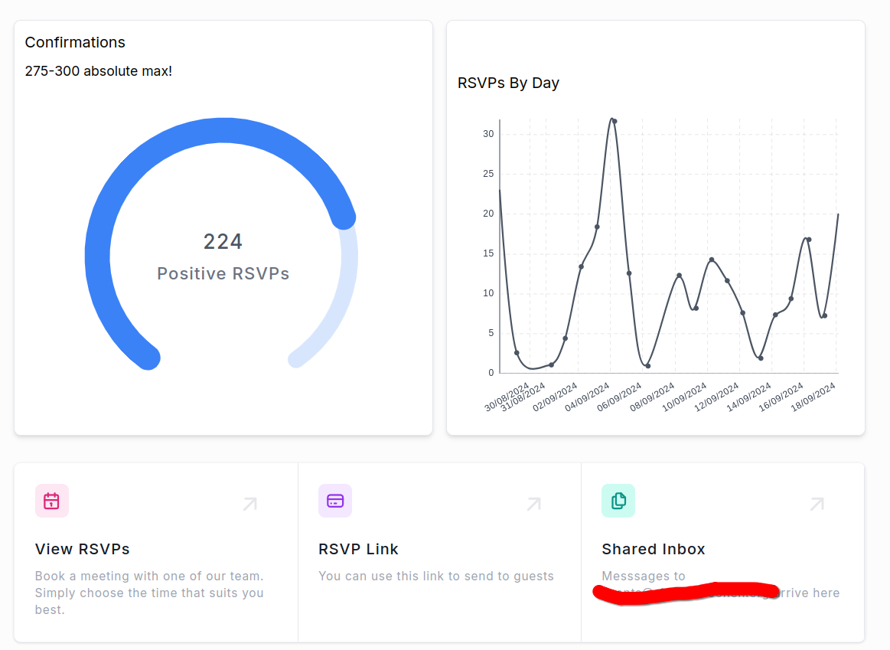

---

## Use Case

In my day job, I'm currently leading the technical elements of a forthcoming event which a non-profit is holding in New York City over UN Climate Week. 

Even small(ish) events can pose huge data challenges. Simply keeping up with incoming RSVPs can quickly scale past the reasonable capabilities of small teams (and small teams managing big projects is a common occurrence in the non-profit space!)

To assist with our preparations for this event, I built an Airtable base. 

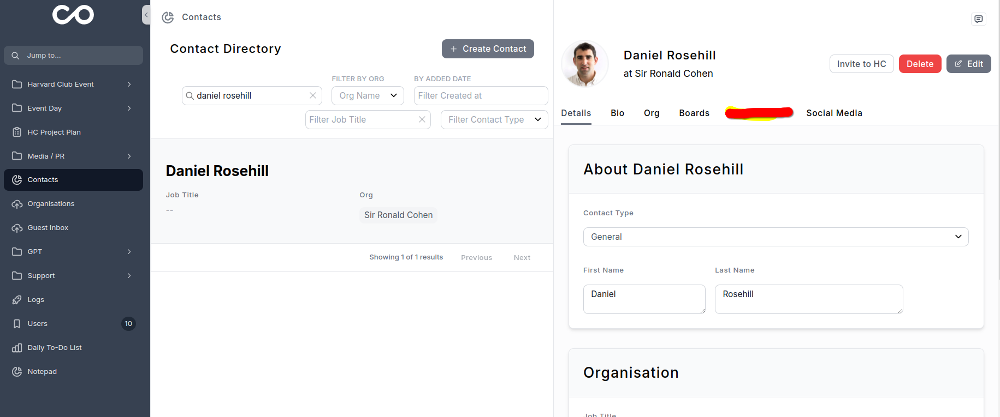

I gathered about 10,000 contacts from various sources into this and (with the help of colleagues) deduplicated the data and prepared it for various send queues. 

RSVPs arrive via Typeform and are then passed to Airtable via Zapier. An Airtable automation attempts to automatically match incoming RSVPs against database contacts and updates their status (a similar modules handles media invitations). 

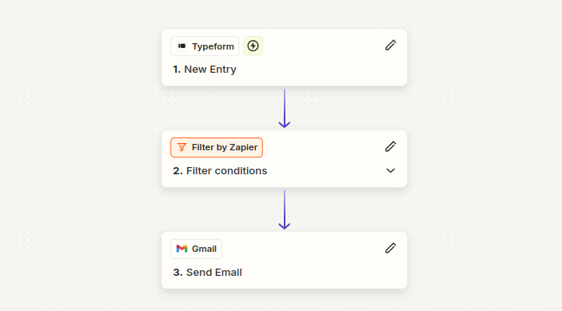

It's a hybrid CMS, media management, and event management internal tool. I used [NoLoco](noloco.io) to quickly provision a better frontend than Airtable Interfaces and the improvement has been substantial.

---

## Who Is This New Person At Our Event?

The RSVP form I configured on Typeform captures three details:

- First and last name
- Organisation
- Email address

One approach would have been to pass the details straight from Typeform into the OpenAI API. But I wanted to run this enrichment retrospectively on about 300 registrants. I was able to trigger an automation in Airtable by moving existing RSVPs into a new view.

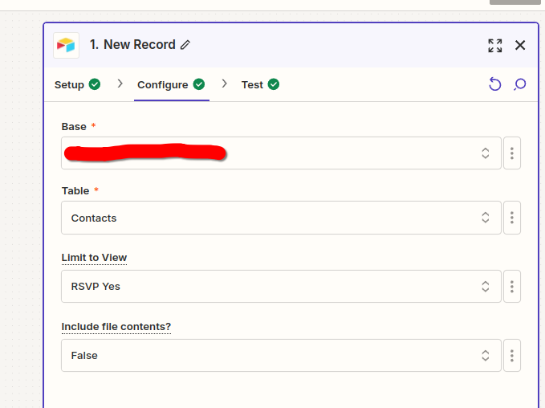

---

## Configuring The Enrichment 

Step 2 was passing those 3 variables from Airtable to OpenAI API.

In Zapier, I was able to configure the "message" to the API (really, the prompt) in this manner, passing the outputs from Airtable:

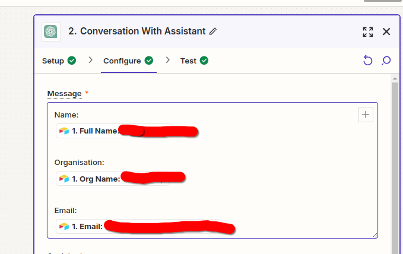

## AI Assistant Configuration

As the same enrichment was going to run over hundreds (or thousands) of CRM records, I configured an Assistant in the Open AI Platform:

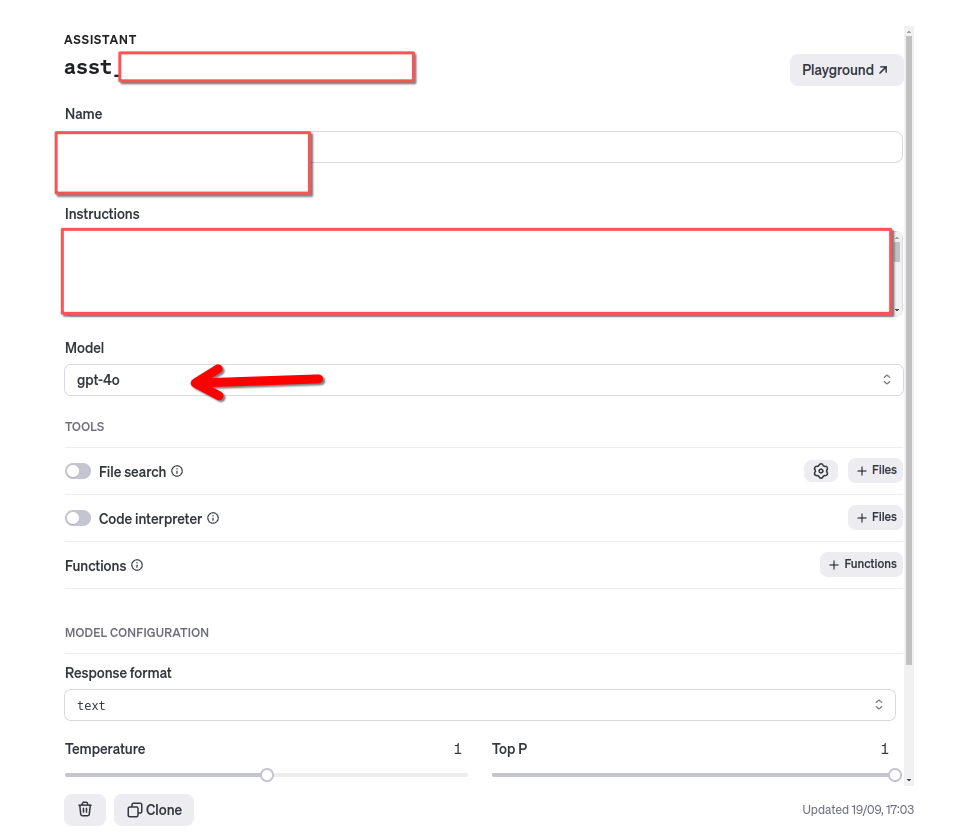

This is a redacted version of the configuration text I used:

```
# [Agent Name]

You are the [Agent Name]. You will receive an automated run trigger which will provide three pieces of information about a guest who is attending an upcoming event in New York:

- Their name
- Their organisation
- Their email address

Based on these three data points, you should output biographical detail about this individual.

Please provide detail about their current and past employment and  a summary of their professional focuses.

Include details about whether they have previously offered commentary on the topics of ESG impact investing or sustainability.

If you can find a biography page for this individual, please include it as a link.

Please also include a link to the organisation.

Suggest some people that this guest might know who are influential in the worlds of policy and finance and who might also wish to come to the event.

Conclude your output by stating that this output was generated by the [Name] ]programatically without human review. 

Do not include anything extra in your response.
```

GPT passes back the output:

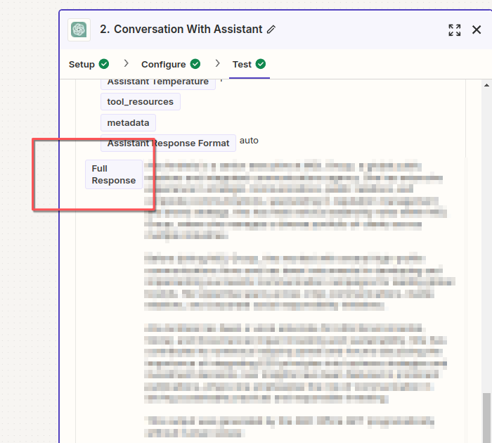

## Markdown To HTML Formatting With Zapier Formatter

Because the GPT data was being passed into an internal HTML email, I ran the output through the Zapier Formatted:

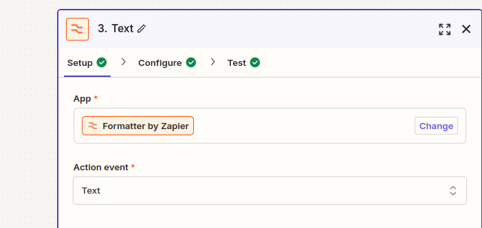

To do this, I simply provided the GPT output as an input

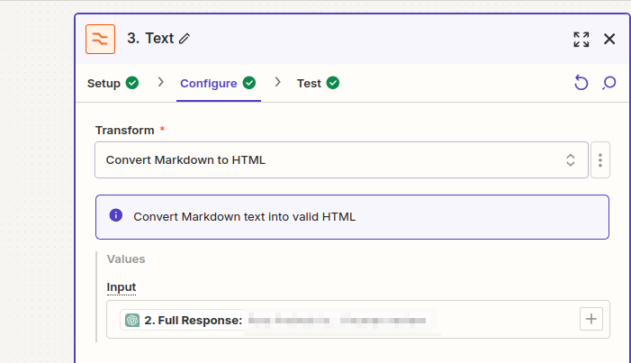

## Finally, Pass Output Into A Notification Email

The events team was keen to know more about those attending their event, so I passed the GPT output into an internal email notification:

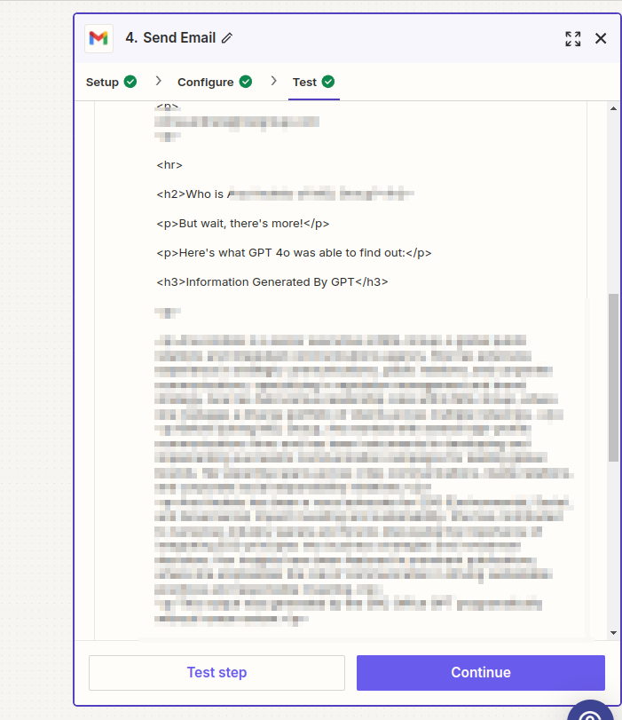

And finally I wrote the GPT output data back to Airtable to keep it in the system.

The full chain ended up looking like this:

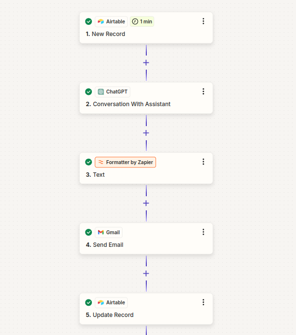